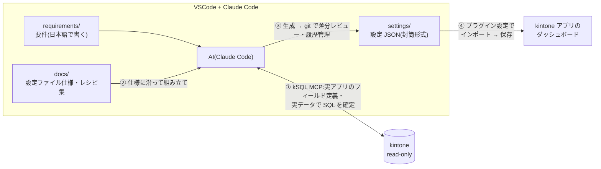

# kSQL Dashboard Pro — AI 設定オーサリング環境

**kintone プラグイン「kSQL Dashboard Pro」のダッシュボード設定 JSON を、
AI(Claude Code + kSQL MCP)に作らせる**ためのテンプレートです。

要件を文章で伝えると、AI が**実アプリのフィールド定義・実データを確認しながら** SQL を確定し、
インポートできる設定 JSON を `settings/` に生成します。設定は git で履歴管理できます。



> プラグイン本体(kSQL Dashboard Pro)は別途入手してください。
> 製品紹介: https://qiita.com/rex0220/items/9c7a5a2aea28198c438b
> このテンプレートのハンズオン記事(画像付き): https://qiita.com/rex0220/items/978aa4d8fa66fb33ba72

## 前提

- Node.js 20 以上
- VSCode + [Claude Code](https://claude.com/claude-code)(サブスクリプションが必要)
- kintone のログインユーザー(**2 要素認証なし**のアカウント。閲覧専用アカウントがあればベスト)

## セットアップ(7 ステップ)

1. **リポジトリを作る** — このページ右上の **Use this template → Create a new repository** →
   自分のアカウントに **private** で作成 → clone
   (設定 JSON にはアプリ番号・フィールド名・業務用語が入ります。**public にしないでください**。
   作成画面の visibility は **Public が初期値**なので必ず Private に切り替えます。
   「Open in a codespace」はこの手順では使いません — ローカルの VSCode + Claude Code が前提です)

   [GitHub CLI](https://cli.github.com/) があれば、1 行で private 作成 + clone まで済みます:
   ```
   gh repo create ksql-dashboards --template rex0220/ksql-dashboard-pro-authoring --private --clone
   ```
2. **依存を入れる**
   ```
   npm install
   ```
   kSQL エンジンと MCP サーバーが入ります。これだけです。
3. **認証情報を置く** — まず `.env.example` をコピーして `.env` を作り、接続先を書きます:
   ```
   KSQL_BASE_URL=https://<自分の環境>.cybozu.com
   ```
   ログイン名・パスワードの置き場所は 2 通りあります(**OS 環境変数が優先**され、
   .env は不足分を埋めるだけです):

   - **推奨: OS のユーザー環境変数** — パスワードをプロジェクト内のファイルに残しません。
     Windows ならコマンドプロンプトで:
     ```
     setx KSQL_USERNAME "<ログイン名>"
     setx KSQL_PASSWORD "<パスワード>"
     ```
     を実行して **VSCode のウィンドウをすべて閉じ、起動し直します**
     (「システムのプロパティ → 環境変数」画面でも可)。
     **「Reload Window」では反映されません。** ターミナルから `code` で起動している場合は
     そのターミナルも開き直してください。反映確認は VSCode のターミナルで:
     ```
     node -e "console.log(process.env.KSQL_USERNAME ?? '(未設定)')"
     ```
   - **簡易: `.env` に書く** — `KSQL_USERNAME` / `KSQL_PASSWORD` の 2 行を足すだけ。
     `.env` は .gitignore 済みですが、ファイルに平文で残る点は理解して使ってください
     (macOS / Linux は GUI 起動の VSCode に環境変数が渡りにくいため、こちらが現実的です)

   共通の注意:
   - このユーザーが**閲覧できるアプリ**が AI から見えます(アプリ一覧・フィールド定義・実データ)
   - **2 要素認証を有効にしたアカウントでは使えません**。可能なら閲覧権限だけの
     専用アカウントを用意するのが安全です
   - 認証情報の設定を変えたら、Claude Code(VSCode)を再起動して反映します

   <details>
   <summary>代替: API トークン認証(read-only をサーバー側で担保したい場合)</summary>

   `KSQL_USERNAME` / `KSQL_PASSWORD` の代わりに `KSQL_TOKEN` を書きます。
   トークンは**アプリ単位**です: 対象アプリの設定 → カスタマイズ/サービス連携 →
   **API トークン** → 生成 → アクセス権は**「レコード閲覧」のみ** → 保存 → **アプリを更新**
   (アプリ更新を忘れると 401 になります)。複数アプリはカンマ区切りで連結(最大 9 個)。
   ただし**トークンを発行したアプリしか見えない**ため、アプリ一覧から探す使い方はできません。
   対象アプリが確定している運用向けです。
   </details>
4. **VSCode で開いて Claude Code を起動** — 初回に kSQL MCP サーバーの使用可否を
   聞かれるので許可します(登録内容は `.mcp.json`)。
   以後の作業では、kintone の**読み取り**と `settings/` / `requirements/` への
   **ファイル保存**は確認なしで進みます(同梱の `.claude/settings.json` で許可済み。
   逆に kintone への書き込みツールは同ファイルで**拒否**しています)
5. **疎通確認** — Claude Code に頼みます:
   ```
   ksql_show_apps を実行して
   ```
   アプリ一覧が返れば準備完了です。
6. **作る** — `requirements/` に要件を書くか、そのままチャットで伝えます:
   ```
   アプリ 4149(案件管理)に、フェーズ別売上の棒グラフと今月受注の KPI のダッシュボードを作って
   ```
   AI が `settings/` に設定 JSON(封筒形式)を生成します。
   - **アプリはできるだけ番号で指定**してください(番号はアプリの URL `/k/番号/` に
     出ています)。名前だけだと、同名・類似名のアプリ(テスト用コピーなど)が複数ある
     環境で取り違えのもとになります
   - **全面のダッシュボードを置くなら、kintone 側でカスタマイズ形式の一覧を手作業で
     先に作っておきます**(AI は kintone の設定を変更できません)
   - タブあり・期間切り替えあり・作成後の変更依頼など、**指示の書き方の実例は
     [docs/指示レシピ例.md](docs/指示レシピ例.md)** にまとめてあります
7. **反映する** — アプリの設定 → プラグイン → kSQL Dashboard Pro の設定 →
   **ツール → インポート**(または「このビューへ取り込む」)→ **保存**。
   検証に失敗した場合、既存設定は変更されません。

## 設定ファイルの管理ルール(settings/)

- **固定名で上書き保存**し、履歴は git の diff で追う(日時付きファイル名を増やさない)
- **git が正** — 設定画面(GUI)で直したら、エクスポートして settings/ へ戻してコミットする
- 常に**封筒形式**(`date` / `pluginName` / … / `config`)。素の config だけのファイルは作らない
- アプリが増えたら**アプリ名のフォルダー**で分ける(詳細は [settings/README.md](settings/README.md))
- 配布・環境移行を想定する設定は**論理アプリ名**(`LAPP_<名前>` + `logicalApps`)で書く —
  環境差はマッピング表 1 か所になる

## テンプレートの更新を取り込む

プラグインの新機能に合わせて、このテンプレートの docs/(仕様書・レシピ集・サンプル)は
更新されていきます。テンプレートから作ったリポジトリは自動では追随しないため、
取り込みたいときは次を実行します:

```
git remote add template https://github.com/rex0220/ksql-dashboard-pro-authoring.git   # 初回のみ
git fetch template
git merge template/main --allow-unrelated-histories
npm install
```

- 自分の設定(`settings/` や `requirements/` に足したファイル)と `.env` はそのまま残ります。
  衝突が出るのは、テンプレート由来のファイル(docs/ や README)を自分で編集した場合だけです
- テンプレート側は今後も `settings/` に README.md 以外、`requirements/` に example.md 以外の
  ファイルを追加しません(あなたのファイルと衝突しないための約束です)
- 最後の `npm install` は、テンプレートが kSQL エンジンの新バージョンを指すようになった
  場合の更新です(エンジンだけ上げたいときは `npm update @rex0220/kintone-sql-tools` でも可)

## ドキュメント

| ファイル | 内容 |
| :--- | :--- |
| [docs/設定ファイル仕様.md](docs/設定ファイル仕様.md) | 設定 JSON の形式の**正本** |
| [docs/ダッシュボードレシピ集.md](docs/ダッシュボードレシピ集.md) | SQL の書き方と設計原則 |
| [docs/AI設定オーサリング手順.md](docs/AI設定オーサリング手順.md) | 作業手順の詳細 |
| [docs/samples/](docs/samples/) | 動作確認済みの実例(雛形にどうぞ) |
| [CLAUDE.md](CLAUDE.md) | AI への常設指示(このリポジトリを開いた Claude Code が自動で読みます) |

サンプルのアプリ番号(4147〜4149)は kintone の SFA(営業支援)パックの例です。
自分の環境の番号に読み替えるか、インポート時の **APPID 変換**機能を使ってください。

## トラブルシュート

| 症状 | 確認すること |
| :--- | :--- |
| MCP サーバーが起動しない | Node.js 20 以上か(`node -v`)。`npm install` 済みか。`.env` を作ったか(無いと起動時エラーになります) |
| `AuthError: token is not resolved` | 認証情報が MCP サーバーに届いていない。`.env` の `KSQL_USERNAME` / `KSQL_PASSWORD` が空のままか、OS 環境変数の設定後に **VSCode を完全再起動していない**(Reload Window では反映されません) |
| 401 / 権限エラー | ログイン名・パスワードの誤り。**2 要素認証が有効なアカウントは使えません**。`KSQL_BASE_URL` のドメイン。トークン認証の場合は発行後に**アプリを更新**したか |
| アプリが見えない・少ない | そのユーザー(またはトークン)にアプリの閲覧権限があるか |
| インポートで「出力元の情報がありません」 | 生成された JSON が封筒形式でない。AI に「封筒形式で出力し直して」と伝える |
| ペインが「SQL にエラー」 | 設定画面でそのペインを開き構文チェック・実行計画(EXPLAIN)を確認 |

## セキュリティ

- このテンプレートは kintone を**読み取り専用**で使います。書き込みは 3 層で防いでいます:
  ① [CLAUDE.md](CLAUDE.md) で書き込みツールの使用を禁止
  ② `.claude/settings.json` で書き込みツール(`ksql_mutate`)を**拒否設定**
  ③ kSQL MCP 側の DML 承認ゲート(書き込みには明示の承認パラメーターが必要)
- サーバー側から完全に担保したい場合は、閲覧権限だけの専用アカウント、
  または「閲覧」のみの API トークン認証(ステップ 3 の代替)を使ってください
- 認証情報は `.env`(コミット対象外)のみに置く
- 生成した設定 JSON には業務情報が含まれるため、リポジトリは private を推奨
